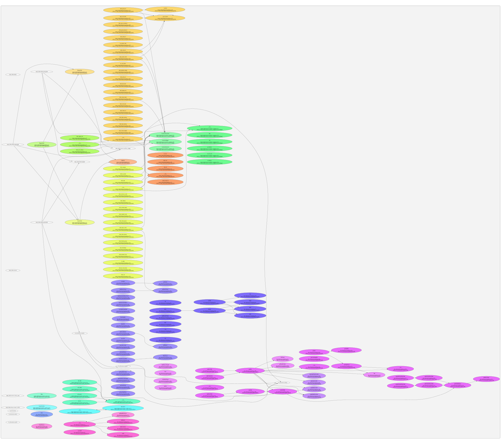

# TFG 

| Idioma | Titulo |
|--------|--------|
| Galego | `Desenvolvemento de ferramentas para a automatización e validación de procesos dixitais` |
| Castellano | `Desarrollo de herramientas para la automatización y validación de procesos digitales`
| English |`Automation and validation tool development for digital processes.` |

## DIRECTORES/AS DO TFG

| APELLIDOS | NOMBRE | EMAIL |
|-----------|--------|-------|
| Fariña Lamosa | Ángel José | angel.farina@udc.es|
| Taibo Pena | Francisco Javier | javier.taibo@udc.es

