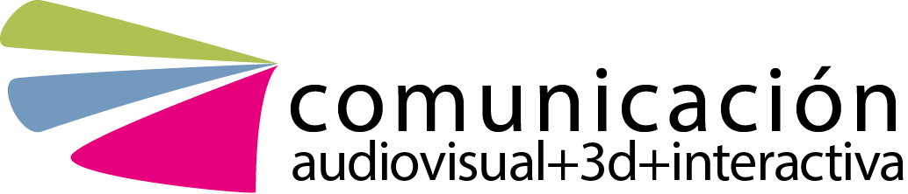

# Desarrollo de herramientas para la automatización y validación de procesos digitales 

Autor: Andres Mendez del Rio

Tutores: Angel José Fariña Lamosa | Francisco Javer Taibo Pena

</img>

</img>

Grado en Creación Digital, Animación y Videojuegos
Curso: 2023/24
Fecha

## Indice de Contenidos
- [Información](#información)
    - [Titulo](#titulo)
    - [Palabras Clave](#palabras-clave)
    - [Resumen](#resumen)
        - [Castellano:](#castellano)
        - [Galego](#galego)
        - [English](#english)
- [Introduccion y Descripcion](#introduccion-y-descripcion)

## Información

### Titulo

- Galego: Desenvolvemento de ferramentas para a automatización e validación de procesos dixitais. 

- Castellano: Desarrollo de herramientas para la automatización y validación de procesos digitales. 

- English: Automation and validation tool development for digital processes. 

### Resumen

#### Castellano 
Pese a la importancia del desarrollo de herramientas y procesos de validación de assets en la industria de la animación, no suele enseñarse esta disciplina a nivel educativo. Sin embargo, desarrollar herramientas de automatización, de control de calidad, de validación de procesos, etc. demuestra un conocimiento avanzado de la tarea que se realiza.

Requiere construir un sistema que realice la tarea, minimice el tiempo requerido para hacerla, y cree un resultado final.

También requiere desarrollar otro sistema cuya función sea analizar y examinar el proceso realizado, y evaluar su correcta realización.

En este TFG planeo desarrollar herramientas y ampliar mis conocimientos sobre procesos de una producción. Estudiar profundamente una tarea, automatizarla y comprobar su calidad deforma automática, para impulsar el inicio del desarrollo de herramientas dentro de la UDC, y sobre todo dentro de CDAV.

#### Galego

A pesar da importancia do desenvolvemento de ferramentas e procesos de validación de assets na industria da animación, non adoita ensinarse esta disciplina a nivel educativo. Con todo, desenvolver ferramentas de automatización, de control de calidade, de validación de procesos, etc. demostra un coñecemento avanzado da tarefa que se realiza.

Require construír un sistema que realice a tarefa, minimice o tempo requirido para facela, e cre un resultado final.

Tamén require desenvolver outro sistema cuxa función sexa analizar e examinar o proceso realizado, e avaliar a súa correcta realización.

Neste TFG planeo desenvolver ferramentas e ampliar os meus coñecementos sobre procesos dunha produción. Estudar profundamente unha tarefa, automatizala e comprobar a súa calidade de forma automática, para impulsar o inicio do desenvolvemento de ferramentas dentro da UDC, e sobre todo dentro de CDAV.

#### English
Despite the importance of developing asset validation tools and processes in the animation industry, this discipline is not often taught at the educational level. However, developing tools for automation, quality control, process validation, etc. demonstrates advanced knowledge of the task at hand.

It requires building a system that performs the task, minimizes the time required to do it, and creates an end result.

It also requires developing another system whose function is to analyze and examine the process performed, and evaluate its correct performance.

In this dissertation I plan to develop tools and expand my knowledge of production processes. To deeply study a task, automate it and check its quality in an automatic way, to boost the beginning of the development of tools within the UDC, and especially within CDAV.

### Palabras Clave

- Galego: Desenvolvemento, Programación, Automatización, Código Aberto, Ferramentas

- Castellano: Desarrollo, Programación, Herramientas, Animacion, Automatización, Código
Abierto
- English: Development, Programming, Tools, Automation, Open Source

## Introduccion y Descripcion

### Introduccion

<!-- 
El contenido de este apartado debe versar sobre el TFG, establecimiento de objetivos,
metodología, retos, motivación… una especie de guía capaz de ofrecer al lector la información
necesaria para entender globalmente el proyecto, la memoria y los anexos.

Evitar especificar únicamente la cantidad de ítems realizados y enfocar más este apartado hacia
los objetivos profesionales y formativos necesarios para alcanzar los resultados 

¿Por qué hacemos este TFG? ¿Cuáles son los puntos fuertes del proyecto? ¿En qué nos hemos
centrado? ¿Qué contenidos tratados en el grado hemos desarrollado principalmente? ¿Por qué
hemos decidido hacer este proyecto? ¿Cómo hemos planteado el trabajo para conseguir nuestros
objetivos? ¿A qué retos nos hemos enfrentado? ¿Qué pasos hemos seguido?...
-->

### Descripcion

<!-- 
En este apartado se deben tratar los contenidos descriptivos más destacables del proyecto, del
producto final fruto del TFG.

Se recomienda realizar un organigrama organizado por fases de producción, que permita
identificar visualmente y de una forma ordenada los diferentes procesos seguidos para realizar el
producto final fruto del TFG.

¿De qué va el proyecto? ¿Para quién lo hemos hecho y por qué? ¿Cuál es la historia, idea y/o
propósito principal que orbita alrededor del proyecto? ¿Qué sub-objetivos hemos tenido que
conseguir para poder terminar este proyecto? ¿Dónde se exhibirá? ¿Qué repercusión tendrá?
¿Cuál es el estilo visual, creativo, artístico… que hemos conseguido para alcanzar los objetivos?
¿Cómo hemos organizado el proyecto? ¿Qué pipeline hemos seguido?...
 -->

## Estudio previo y documentacion
<!-- 
Contendrá todo el material relacionado con la búsqueda de referencias, estudio de casos, análisis,
documentación descriptiva del proyecto, problemas y soluciones específicas…

El tipo de proyecto desarrollado para el TFG definirá el contenido y organización de este apartado,
cuyo objetivo es el de describir la metodología utilizada para la búsqueda, recolección y análisis del
estado actual de la producción, conocimiento, cuestión... sobre la que se planificó la fase de
desarrollo del TFG.

El rigor académico de las fuentes de información se fundamenta en el estudio del conocimiento
publicado en libros, artículos de investigación, comunicaciones, master class... por ello es importante
que durante esta fase el alumnado no se limite solo al estudio de obras audiovisuales, videojuegos,
páginas web... y fundamente parte del desarrollo de su TFG en fuentes documentales más
académicas.

¿Cuáles fueron los objetivos específicos de esta fase? ¿Qué fuentes se consultaron? ¿Qué referencias
fueron seleccionadas y por qué? ¿Qué pruebas se hicieron? ¿Cómo se ha hecho, analizado, aplicado...
anteriormente por otros profesionales? ¿Qué metodología de trabajo concreto se siguió? ¿Qué
decisiones concretas fueron tomadas? ¿Cuáles son las conclusiones específicas de este proceso?..
-->

## Elaboracion del Producto
<!-- 
En este apartado se podrán describir los procesos y/o tareas relacionadas con la fase de desarrollo,
preproducción, producción, postproducción, programación y/o testeo. La creación, configuración y/o
adaptación de todos los contenidos artísticos, teóricos y/o técnicos necesarios para conseguir realizar
el producto final del TFG. Deben mostrarse especialmente los procedimientos técnicos y artísticos de
interés para la resolución de problemas y/o peculiaridades alejadas de la norma y evitar
descripciones semejantes a tutoriales.

El tipo de proyecto desarrollado para el TFG definirá el contenido y organización de este apartado,
cuyo objetivo es el de presentar y describir de manera organizada la puesta en marcha del producto
o resultado final fruto del TFG (modelado de assets, arte de concepto, set-up, animática, encuestas,
quests, grabación de voces...)

Se recomienda organizar el contenido de este apartado en las diferentes fases de trabajo realizadas.
Se recomienda que cada sub-apartado describa los objetivos, procesos, problemas y conclusiones de
cada fase de realización.

¿Cuáles fueron los objetivos específicos de esta fase? ¿Qué contenidos y/o procesos fueron creados
por los autores del TFG y cuales se utilizaron de otras fuentes? ¿Qué problemas nos encontramos y
cómo los solucionamos? ¿Qué aprendizaje alcanzamos en cada proceso?. 
-->
## Conclusiones
<!-- 
En las conclusiones podrían tratarse, de una manera reflexiva y crítica, todos los aspectos
relacionados con el TFG, el trabajo en equipo e individual, el alcance de los objetivos propuestos y la
propuesta de posibles mejoras.

Postmorten. Teniendo en cuenta los problemas, soluciones y conclusiones definidas en los apartados
anteriores, se recomienda hacer una reflexión crítica de todo el proceso con el objetivo de entender y
definir posibles mejoras.

¿Cómo hemos trabajado en equipo? ¿Cuáles son las principales fortalezas del proyecto? ¿Qué
podríamos haber hecho para alcanzar mejores resultados? ¿Qué objetivos se han alcanzado y/o
cuáles no y por qué? ¿Qué cambiaríamos si pudiéramos volver atrás? ¿Qué dinámicas se han seguido
para detectar los errores y cuáles fueron las soluciones o los callejones sin salida encontrados?...
 -->

## Links

[Creating an efficient animation pipeline for your studio](https://www.foundry.com/insights/film-tv/animation-pipeline)
